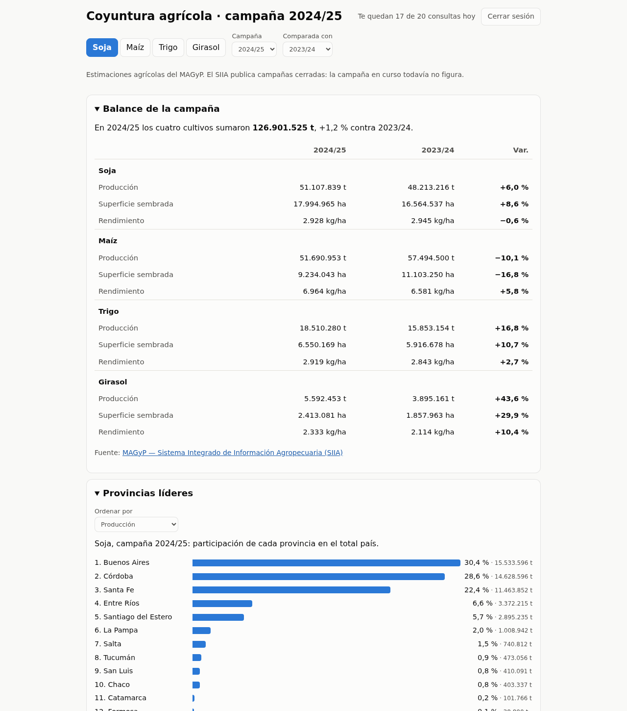

# Coyuntura agrícola

Informe de la campaña agrícola argentina para soja, maíz, trigo y girasol: producción, superficie y
rendimiento contra la campaña anterior, provincias líderes, evolución del rendimiento en los últimos
diez años y un mapa por departamento.

**En vivo: [agro.mymcps.dev](https://agro.mymcps.dev)**



Es también un **ejemplo de cómo construir una aplicación sobre [Argentina Data MCP](https://argentinadata.mymcps.dev/?ref=coyuntura-agricola)**,
un servidor MCP con datos públicos argentinos. Esta app no tiene backend propio ni guarda datos: cada
número de la página es una consulta en vivo a las tools del MCP, hecha con la cuenta del visitante.

## Qué tools del MCP usa

Los datos son las [estimaciones agrícolas del MAGyP](https://datos.magyp.gob.ar/dataset/estimaciones-agricolas)
(Sistema Integrado de Información Agropecuaria, SIIA), que el MCP sirve en cinco tools:

| Tool | Para qué la usa el informe | Llamadas |
|---|---|---|
| `siia_cultivos_disponibles` | Qué campañas hay, para el selector | 1 por visita |
| `siia_balance_campania` | Balance nacional de la campaña elegida y de la de comparación | 2 |
| `siia_ranking_provincias` | Provincias por producción, superficie o rendimiento, con su participación | 1 por cultivo y métrica |
| `siia_evolucion_rendimiento` | Rendimiento de las últimas 10 campañas, país o provincia | 1 por cultivo y zona |
| `siia_estimaciones_cultivo` | Todos los departamentos de una campaña, para el mapa | 1 por cultivo y campaña |
| `consultar_cuota` | Cuántas consultas le quedan al visitante (no consume cuota) | — |

Todas se llaman igual: un `POST` JSON-RPC al endpoint del MCP con el token del visitante.

```http
POST https://argentinadata.mymcps.dev/mcp
Authorization: Bearer <token del visitante>
Content-Type: application/json
Accept: application/json, text/event-stream

{"jsonrpc":"2.0","id":1,"method":"tools/call",
 "params":{"name":"siia_ranking_provincias",
           "arguments":{"cultivo":"soja total","campania":"2024/2025","metrica":"produccion","top_n":24}}}
```

La respuesta llega como un evento SSE, y el dato está en `result.content[0].text`, serializado como JSON:

```json
{"cultivo":"soja total","campania":"2024/2025","metrica":"produccion",
 "ranking":[{"posicion":1,"provincia":"Buenos Aires","valor":15533596,"share_pct":30.39},
            {"posicion":2,"provincia":"Córdoba","valor":14628596,"share_pct":28.62}, "…"],
 "unidad":"toneladas","fuente":"MAGyP — Sistema Integrado de Información Agropecuaria (SIIA)"}
```

El cliente completo, con reintentos y manejo de errores, está en [`src/mcp/cliente.ts`](src/mcp/cliente.ts).
Las cinco llamadas, con sus argumentos, están en [`src/datos/consultas.ts`](src/datos/consultas.ts):
si querés armar otra cosa con el MCP, empezá por ahí.

## Por qué no hace falta ninguna API key

Un sitio estático no puede guardar un secreto. Una key metida en el JavaScript la ve cualquiera
con F12, y una restringida por dominio se usa igual desde `curl` falsificando el `Origin`. Un proxy
la esconde, pero queda como una URL pública que cualquiera puede usar para gastar la cuota del dueño.

Por eso **se autentica el visitante, no el sitio**. El botón "Ver el informe completo" usa OAuth
2.1 con PKCE, el flujo pensado para apps que corren en el navegador sin backend:

1. El sitio genera un secreto de un solo uso (`code_verifier`) y manda al visitante a la página de
   autorización del MCP con su hash.
2. El visitante entra con Google (si no tiene cuenta, se crea en ese momento; es gratis).
3. El MCP vuelve al sitio con un código, que el sitio canjea por el token presentando el secreto original.
4. El token queda en `sessionStorage` y se borra al cerrar la pestaña.

Cada consulta sale de la cuota del visitante. El plan gratuito trae 20 consultas por día: abrir el
informe usa 3 y cada sección que se abre, una más. El sitio no repite una consulta que ya hizo en la
misma visita y muestra cuántas quedan. El detalle está en [`src/mcp/oauth.ts`](src/mcp/oauth.ts) y en
[docs/decisiones/0001](docs/decisiones/0001-acceso-oauth-en-vivo.md).

## Correrlo en tu máquina

```bash
git clone https://github.com/abenassi/coyuntura-agricola-ar
cd coyuntura-agricola-ar
npm install
npm run dev        # http://localhost:5173
```

El `client_id` de este repo ya acepta volver a `http://localhost`, así que podés ingresar con tu
cuenta y usar el informe completo en local.

```bash
npm test           # tests unitarios (vitest)
npm run e2e        # el informe en un navegador, con el MCP simulado desde respuestas reales
npm run verificar  # tipos + tests + build
```

## Publicar tu propia versión (fork)

1. Forkeá el repo y en *Settings → Pages* elegí **GitHub Actions** como origen.
2. Registrá tu sitio como cliente OAuth del MCP y copiá el `client_id` que imprime en `src/config.ts`:
   ```bash
   npm run registrar-cliente -- --redirect https://<tu-usuario>.github.io/coyuntura-agricola-ar/ --redirect http://localhost:5173/
   ```
3. Borrá `public/CNAME` y hacé push a `main`: el workflow testea, compila y publica en
   `https://<tu-usuario>.github.io/coyuntura-agricola-ar/`. Si querés un dominio propio, configuralo en
   *Settings → Pages → Custom domain* (cuando Pages publica desde Actions, el archivo `CNAME` no alcanza) y
   registrá esa URL con `registrar-cliente`.

No hay que configurar ningún secret. La pantalla de autorización del MCP va a mostrar una advertencia
("No reconocemos ese destino") para tu dominio: es la protección contra phishing para apps que el MCP
no conoce, y está bien que aparezca.

## Cómo está organizado

```
src/
  config.ts              lo único que cambia entre despliegues (client_id, dominio)
  mcp/cliente.ts         llamadas JSON-RPC al MCP: memo por visita, reintentos, errores tipados
  mcp/oauth.ts           ingreso del visitante con OAuth 2.1 + PKCE
  datos/consultas.ts     una función por tool del MCP
  datos/calculos.ts      variaciones, campañas, cortes del mapa (funciones puras)
  geo/cruce.ts           cruce de los departamentos del SIIA con los polígonos del INDEC
  ui/secciones/          balance, ranking, evolución y mapa; cada una carga cuando se abre
  analytics.ts           métricas de uso
public/geo/              polígonos de departamentos (INDEC), simplificados
scripts/                 registrar el cliente OAuth, preparar la geometría
tests/                   unitarios, fixtures con respuestas reales del MCP y e2e con Playwright
docs/decisiones/         por qué está hecho así
```

Stack: TypeScript y Vite sin framework, [Chart.js](https://www.chartjs.org/) para la evolución,
[Leaflet](https://leafletjs.com/) para el mapa. Nada se carga desde un CDN, y la página tiene una
política de contenido estricta: la única excepción es el script de Cloudflare Web Analytics.

### El mapa por departamento

El SIIA trae los datos por departamento pero sin geometría ni código INDEC: sólo provincia y nombre.
Los polígonos son los límites oficiales del Marco Geoestadístico Nacional del INDEC
([capa de departamentos](https://geonode.indec.gob.ar/layers/geonode_data:geonode:departamentos)),
que encajan sin huecos ni superposiciones. `npm run geometria` los baja, los simplifica respetando
los bordes compartidos y los guarda en `public/geo/` (371 KB). El cruce es por provincia y nombre
normalizados, y un test exige que todos los departamentos con datos de la última campaña encuentren
su polígono. La misma capa, a resolución completa, está en la tabla `departamentos` de Argentina Data.
Ver [docs/decisiones/0003](docs/decisiones/0003-geometria-de-departamentos.md).

## Qué mide

El sitio cuenta qué secciones se abren, qué cultivos, campañas y filtros se eligen, en qué
departamentos del mapa se hace clic y cuándo alguien se queda sin consultas. Los eventos van al
mismo MCP, sin cookies y sin guardar la IP: el visitante se cuenta con un hash que rota cada 30 días.
Un fork no manda nada: sólo emite desde `agro.mymcps.dev`. Ver [`src/analytics.ts`](src/analytics.ts).

Además, el sitio publicado pasa por el proxy de Cloudflare, que agrega su Web Analytics (visitas,
páginas, países, rendimiento; sin cookies). Es la única excepción a "sólo scripts propios" en la
política de contenido. En un fork servido desde GitHub Pages no aparece.

## Límites del dato

El SIIA publica **campañas cerradas**: hoy la más reciente es 2024/25. La campaña en curso y las
estimaciones semanales no están en el MCP. Los números son estimaciones oficiales del MAGyP y pueden
revisarse.

## Licencia

MIT. Los datos son del Ministerio de Agricultura, Ganadería y Pesca de la Nación, y los límites
departamentales del INDEC.
